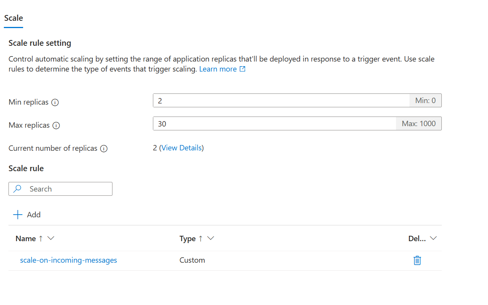
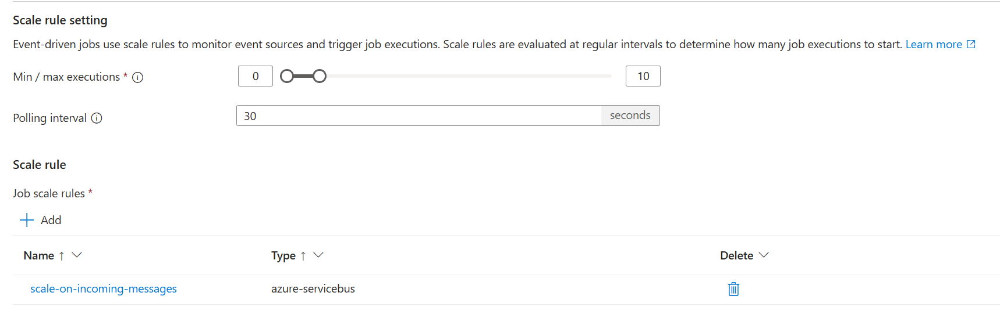

# Three Approaches to Creating a Message Processor in Azure Container Apps

This repository outlines three different methods for implementing a message processor in an Azure Container App connected to an Azure Service Bus. Each approach has its own advantages and trade-offs in terms of scalability, ease of implementation, and flexibility.

> [!NOTE]  
> The information presented in this document has been adapted from the official Microsoft Learn documentation. For more detailed information and the most up-to-date guidance, please refer to the official documentation.

- [Azure Functions Scale and Hosting](https://learn.microsoft.com/en-us/azure/azure-functions/functions-scale)
- [Set scaling rules in Azure Container Apps](https://learn.microsoft.com/en-us/azure/container-apps/scale-app?pivots=azure-portal)
- [Jobs in Azure Container Apps](https://learn.microsoft.com/en-us/azure/container-apps/jobs?tabs=azure-cli#event-driven-jobs)

## 1. Azure Functions

### Implementation
- Create an Azure Function as a container app
- Configure it to trigger on Service Bus messages

### Scaling Behavior
- **Consumption Plan:**
  - Event-driven, automatic scaling
  - Scales out based on the number of incoming events
  - Instances of the Functions host are dynamically added and removed
  - Scales up to 200 instances for Windows, 100 for Linux
  - Scale-out limit of 500 instances per subscription per hour for Linux apps
  
- **Premium Plan:**
  - Event-driven, automatic scaling with pre-warmed workers
  - Scales out based on the number of events functions are triggered on
  - Scales up to 100 instances for Windows, 20-100 for Linux (region-dependent)
  - Supports "always ready" instances to avoid cold starts

- **Dedicated (App Service) Plan:**
  - Manual scaling or autoscale configurations
  - Scales up to 10-30 instances, or 100 instances in an App Service Environment (ASE)

### Advantages
- Serverless architecture reduces operational overhead
- Built-in integration with Azure Services
- Automatic scaling in Consumption and Premium plans
- Pre-warmed instances in Premium plan for reduced cold starts

### Considerations
- Consumption plan may have cold starts for infrequently used functions
- Premium plan offers more consistent performance but at a higher cost
- Dedicated plan requires manual scaling configuration but provides predictable performance

### Use Case Scenarios
- Consumption plan: Ideal for sporadic, short-running functions with variable load
- Premium plan: Suitable for functions that run continuously or nearly continuously, or require more powerful instances
- Dedicated plan: Best for predictable workloads or when specific VM sizes are required

Azure Functions provide a flexible, scalable solution for processing Service Bus messages. The choice between Consumption, Premium, and Dedicated plans depends on your specific requirements for scalability, performance, and cost. The Consumption plan offers true serverless scaling for variable workloads, while the Premium plan provides enhanced performance and eliminates cold starts. The Dedicated plan is best suited for predictable workloads or when you need full control over the scaling behavior.

## 2. Quarkus

> [!NOTE]  
> The information

### Implementation
- Use Quarkus framework to connect to a Service Bus topic
- Deploy the Quarkus application to an Azure Container App
- Configure scaling rules for the Container App

### Scaling Behavior
- Utilizes Azure Container Apps' declarative scaling rules
- Scaling is based on HTTP, TCP, or custom metrics
- Custom scaling can be configured using KEDA scalers

### Key Scaling Concepts
- **Replicas**: Instances of your container app revision created on-demand
- **Scale Limits**: 
  - Minimum replicas: 0 to 1000 (default 0)
  - Maximum replicas: 1 to 1000 (default 10)
- **Scale Rules**: Criteria for adding or removing replicas
- **Scale Behavior**: Combination of rules and limits determining scale decisions

### Configuring Scale Rules
1. HTTP Scaling:
   - Based on concurrent HTTP requests
   - Example: Scale out up to 5 replicas when reaching 100 concurrent requests/second

2. TCP Scaling:
   - Based on concurrent TCP connections
   - Example: Scale out up to 5 replicas when reaching 100 concurrent connections/second

3. Custom Scaling:
   - Based on CPU, memory, or event-driven data sources (e.g., Azure Service Bus)
   - Uses KEDA ScaledObject-based scalers
   - Example: Scale based on Azure Service Bus queue length

### Scaling Behavior Details
- Polling Interval: 30 seconds (default)
- Cool Down Period: 300 seconds (default)
- Scale Up Step: 1, 4, 100% of current (default)
- Scale Down Step: 100% of current (default)
- Scaling Algorithm: `desiredReplicas = ceil(currentMetricValue / targetMetricValue)`

### Advantages
- Simplified development with Quarkus extensions
- Faster startup times and lower memory footprint
- Flexible scaling options through Azure Container Apps
- Can leverage Quarkus' reactive programming model for efficient resource usage

### Considerations
- Requires knowledge of both Quarkus and Azure Container Apps
- Scaling to zero possible, but may not be suitable for all use cases (e.g., when using Dapr actors)
- Vertical scaling not supported in Azure Container Apps

### Use Case Scenarios
- Microservices requiring efficient resource utilization
- Event-driven applications with variable load
- Services benefiting from Quarkus' fast startup and low memory footprint, combined with Azure's scalability

Quarkus on Azure Container Apps provides a powerful combination of efficient application development and flexible, event-driven scaling. By leveraging Quarkus' performance benefits and Azure Container Apps' scaling capabilities, you can create highly responsive and resource-efficient message processing systems that can handle variable workloads effectively.

## 3. Azure SDK with Event-Driven Jobs

### Implementation
- Create a custom application using the Azure SDK for Java (or other supported languages)
- Implement an event-driven job that processes messages from the Service Bus queue
- Configure the job to run in an Azure Container App environment

### Key Concepts
- **Job**: Defines the default configuration for each job execution, including the container image, resource allocation, and the command to run.
- **Job Execution**: A single run of a job, triggered by an event (in this case, a message in the Service Bus).
- **Job Replica**: Typically, one replica per job execution, but can be scaled to multiple replicas in advanced scenarios.

### Advantages
- Maximum flexibility in implementation and control over message processing logic
- Event-driven architecture ensures efficient resource usage
- Can be optimized for specific use cases and complex processing requirements
- Seamless integration with Azure services through the SDK

### Considerations
- Requires more in-depth knowledge of Azure SDK and Container Apps
- Responsibility for implementing efficient scaling and error handling
- May need additional monitoring and logging implementation
- Requires understanding of KEDA scalers for optimal event-driven scaling

### Event-Driven Job Specifics
- Uses KEDA scalers to evaluate scaling rules on a polling interval
- Each job execution typically processes a single event (message)
- Scaling rules determine the number of job executions to run based on event volume
- Ideal for scenarios where each message requires a new container instance with dedicated resources
- Suitable for long-running processing tasks

### Implementation Steps
1. Create an Azure Container Apps environment
2. Define the job configuration using the Azure SDK, specifying:
   - Container image with your message processing logic
   - Resource requirements (CPU, memory)
   - Scaling rules based on Service Bus queue metrics
3. Configure the job as an event-driven job, setting the trigger type to "Event"
4. Implement the message processing logic in your container application
5. Deploy the job to the Azure Container Apps environment
6. Set up monitoring and logging for job executions

### Scaling Behavior
- The job automatically scales based on the number of messages in the Service Bus queue
- Each job execution processes one or a batch of messages, then exits
- New job executions are triggered as more messages arrive, up to the configured maximum replica count

### Use Case Scenarios
- Complex message processing that requires isolated environments for each message
- Long-running tasks triggered by queue messages
- Scenarios requiring fine-grained control over processing logic and resource allocation

By using the Azure SDK to create an event-driven job in Azure Container Apps, you gain the flexibility to implement custom message processing logic while leveraging Azure's managed scaling and event-driven execution model. This approach is particularly suitable for complex or resource-intensive message processing tasks that benefit from isolated execution environments.

## Comparison

| Aspect | Azure Functions | Quarkus | Azure SDK |
|--------|-----------------|---------|-----------|
| Ease of Implementation | High | Medium | Low |
| Flexibility | Low | Medium | High |
| Scalability | Automatic | Configurable | Manual |

When choosing an approach, consider your team's expertise, project requirements, and long-term maintainability. Azure Functions offer simplicity and managed scaling, Quarkus provides a balance of ease and control, while the Azure SDK approach gives you the most flexibility at the cost of increased development effort.